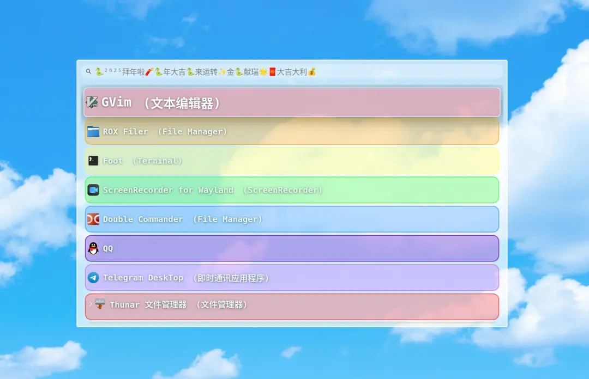

# Custom styles for wofi 

## Usage

复制 ``css`` 文件至你的 wofi 目录并重命名为``~/.config/wofi/style.css`` ，运行``wofi``即可查看主题效果。  
或者在终端中执行以下命令

Copy the ``css ``file to your Wofi directory and rename it to ``~/.config/wofi/style.css``, then run ``wofi`` to test the effects.  

or execute the following command in the terminal

```shell
wofi --style  /path/<name>.css
```

#### 2025蛇年特别奉献  

请修改 ``wofi`` 的配置，在``~/.config/wofi/config`` 中加入以下配置

Please modify the configuration of ``wofi``, add the following configuration to ``~/.config/wofi/config``.

```
prompt=🐍²⁰²⁵拜年啦🧨🐍年大吉🐍来运转✨金🐍献瑞🌟🧧大吉大利💰
```

--------------------

## 1. cyan  


## 2. BGPY2025


## 3. HappyChineseNewYear!!

🐍²⁰²⁵拜年啦🧨🌟金🐍献瑞✨🐍年大吉͎༓🧣蛇来运转✨🧧大吉大利💰财源滚滚✨福满人间🌟

需要将目录中的背景图片一并放在`~/.config/wofi/`目录中。


## 4. 彩虹·Rainbow

感谢 Deepseek！帮我写了这么多颜色。  
当然微调还是得是活人。


Webp animation



## 5. 亚克力·Acrylic

加了一点渐变效果。


