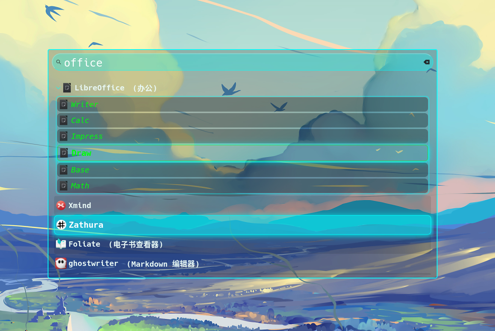

# Custom styles for wofi 

## 1. cyan  

Screenshot 




--------------------
## Usage
Copy the style.css file to your Wofi directory ``~/.config/wofi/style.css``and run ``wofi`` to test the effects.  

or execute the following command in the terminal
```shell
wofi --style  <styles.css>
```


